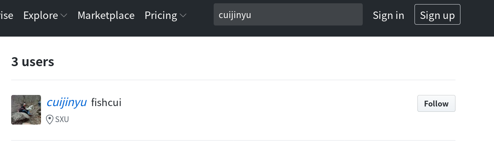
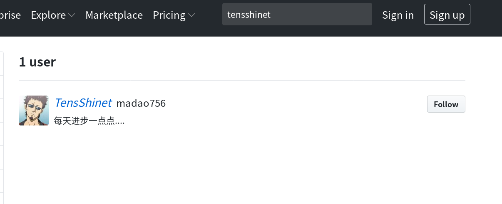
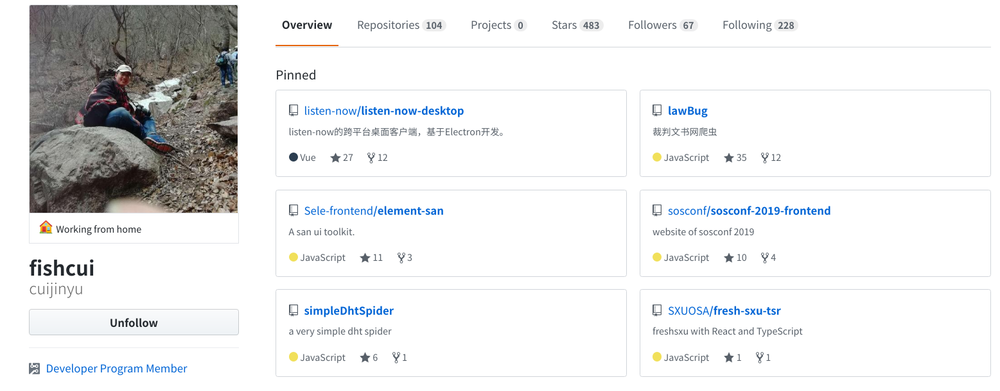
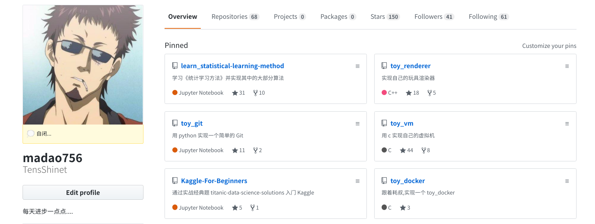
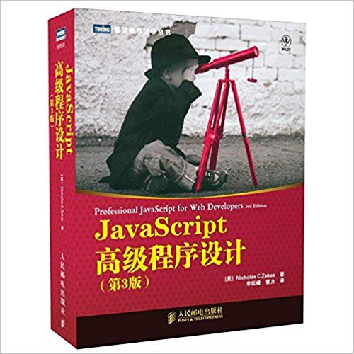

# 2019 山西大学开源软件协会前端学习小组

> 前言：前端是一个不错的方向，大家来学习前端吧

## 0X00 文档目的

旨在给前端学习小组，规划出一个学期至一年的学习内容

## 0X01 学会使用 Git && GitHub

### 资料

非常详细：

https://www.bilibili.com/video/av56828976?from=search&seid=12446151549896266549

### 作业

创建一个属于自己的仓库，并把自己所学记录在这一个仓库中。

选做（**证明你会使用 follow and start**）：

+ 给 `TensShinet` 或者 `cuijinyu` 点 follow

+ 给 `TensShinet` 或者 `cuijinyu` 的任意项目点 `start`

## 0X01 基础

### 资料

+ 视频资料：

**见群**

+ 书籍资料：

1）JavaScript 高级程序设计（看一半就行）

(

### 作业

完成一个简单小游戏，效果如下（可能加载有点慢）：

https://tensshinet.github.io/JSgame/plane/index.html

+ ASDW 移动
+ F 开火

实现小游戏的视频资料（知乎萧井陌大佬）：

https://space.bilibili.com/39066904/channel/detail?cid=21254

将作业提交到 GitHub 上，你的仓库里面。

## 0X02 进阶

上述两个阶段可能花费你一个学期甚至更多的时间去学习。

使用前端框架开发（在这里我列出来的是 vue，你当然可以选择其他框架）：

### 资料

视频资料：https://www.bilibili.com/video/av44699553?from=search&seid=9959119640222962699

### 作业

+ 用你所学干点什么吧

